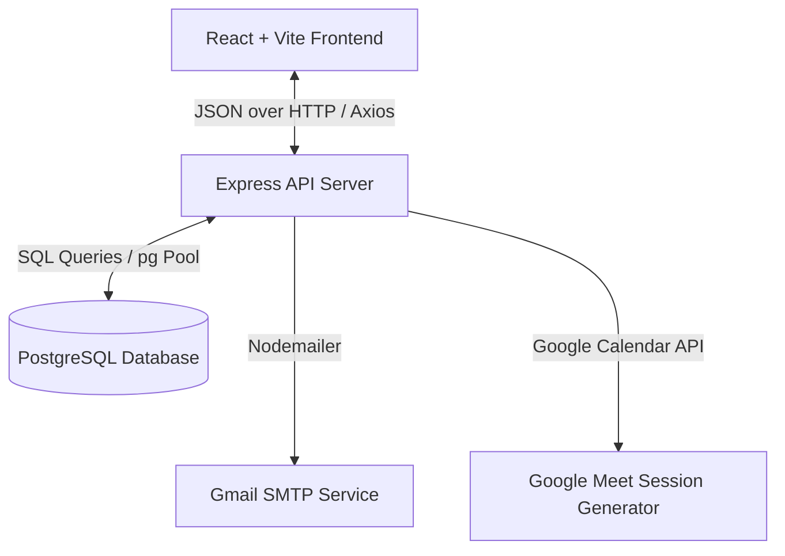

# SkillForge E-Learning Platform
> 🎓 A robust, secure, and index-optimized E-Learning management system powering bootcamps, workshops, structured cohorts, and interactive learning tracks.

[](https://nodejs.org/)
[](https://www.postgresql.org/)
[](https://react.dev/)
[](https://jestjs.io/)
[](https://opensource.org/licenses/ISC)

---

## 📖 1. Project Overview
SkillForge is a full-stack, role-based e-learning and training platform designed to manage educational bootcamps, placement preparation tracks, campus-based workshops, and guided academic projects. It streamlines administrative, academic, and interactive operations, allowing educational providers to run structured cohorts (batches) with maximum transparency and secure access controls.

---

## 💡 2. Why I Built This Project
As an SDE, I wanted to build a real-world, data-driven system that tackles complex business logic, strict security guidelines, and performance optimization. Instead of a basic CRUD app, SkillForge implements:
1. **Multi-role access patterns** (Admin, Instructor, Student) with distinct workflows.
2. **Robust backend security protections** verified by automated integration tests.
3. **Database query optimization** via structured indexes on foreign keys to support fast joins and large-scale data queries.
4. **Third-party system integrations** such as Google Meet / Google Calendar live sessions, SMTP mail delivery, and mock payment validation.

---

## ✨ 3. Key Features

- **🔐 Secure Authentication**: JWT authentication with refresh token support and OTP-based signup and password reset.
- **👥 Role-Based Dashboards**: Separated interfaces and access limits for students, instructors, and administrators.
- **📅 Cohort & Batch Management**: Capacity limits, custom schedules, start/end dates, and enrollment statuses for batches.
- **📖 Curriculum Organization**: Structured courses split into course modules, housing ordered video lessons.
- **🎥 Google Calendar API Integration**: Automatic Google Meet live session link generation for virtual classes.
- **💳 Mock Payment Flow**: Checks and updates payments status before enrolling students.
- **📈 Lesson Progress Tracking**: Tracks checked/completed lessons for enrolled students.
- **📝 Attendance Management**: Live-session attendance marking and student dashboard view.
- **⭐ Reviews & Ratings**: Course feedback, rating limits, and public listing display.
- **🎓 Certificate Placeholders**: Readiness for issuing and viewing student course completion credentials.

---

## 🔑 4. User Roles and Permissions

| Page / Route | Guest (Unauthenticated) | Student | Instructor | Admin |
|:---|:---:|:---:|:---:|:---:|
| **Public Portal (`/`, `/courses`, `/pricing`, `/contact`)** | ✅ View | ✅ View | ✅ View | ✅ View |
| **Auth Actions (`/login`, `/signup`, `/forgot-password`)** | ✅ Access | ❌ Blocked | ❌ Blocked | ❌ Blocked |
| **Student Dashboard (`/dashboard`)** | ❌ Redirect | ✅ Access | ❌ Blocked | ❌ Blocked |
| **Instructor Dashboard (`/instructor`)** | ❌ Redirect | ❌ Blocked | ✅ Access | ❌ Blocked |
| **Admin Panel (`/admin`)** | ❌ Redirect | ❌ Blocked | ❌ Blocked | ✅ Access |
| **Modify User Roles** | ❌ Blocked | ❌ Blocked | ❌ Blocked | ✅ Access |
| **Approve Courses** | ❌ Blocked | ❌ Blocked | ❌ Blocked | ✅ Access |

---

## 🛠️ 5. Tech Stack

### Frontend
- **Framework/Runtime**: React 19 (built with Vite)
- **Styling**: Vanilla CSS & Material UI (MUI) components
- **Routing**: React Router DOM (v7)
- **API Client**: Axios with interceptors for automatic JWT attachment

### Backend
- **Server**: Node.js & Express (v5.x, ES Modules)
- **Database Connection**: `pg` (node-postgres Pool)
- **Authentication**: `jsonwebtoken` (JWT token signatures & validation)
- **Cryptography**: `bcrypt` (password hashing)
- **Mailing**: `nodemailer` (SMTP OTP transmission)
- **Testing**: Jest & Supertest

### Database
- **Engine**: PostgreSQL (v14+)
- **Migrations**: Custom SQL-based migration scripts

---

## 📐 6. System Architecture Overview



---

## 📁 7. Folder Structure

```
SKILLFORGE_E-LEARNING/
├── Backend/                 # Express API server
│   ├── migrations/          # SQL database migration files
│   ├── src/                 # Application source code
│   │   ├── config/          # DB connection configuration
│   │   ├── controller/      # Route controllers (admin, user, instructor, course, etc.)
│   │   ├── middlewares/     # Authentication & role-based middleware
│   │   ├── routes/          # Express route definitions
│   │   └── utils/           # Utilities (email nodemailer helper, etc.)
│   ├── tests/               # Security integration tests (Supertest + Jest)
│   ├── index.js             # Server entry point
│   ├── query.sql            # Main database schema definition
│   └── package.json         # Node.js backend configuration
│
└── Frontend/                # Vite + React Client
    ├── public/              # Static public assets
    ├── src/                 # React source code
    │   ├── api/             # Axios configuration
    │   ├── components/      # Reusable UI components
    │   ├── layout/          # Page layouts (Navbar, Footer, etc.)
    │   ├── pages/           # Pages & Dashboards (Student, Instructor, Admin)
    │   ├── routes/          # App routing & guards
    │   └── services/        # Frontend API call services
    ├── package.json         # Node.js frontend configuration
    └── vite.config.js       # Vite build configuration
```

---

## 🖼️ 8. Screenshots

Below are placeholders representing the application interface.
*(To populate, add screenshots to the `docs/screenshots/` directory)*

* **Home & Landing Page**: `docs/screenshots/home.png`
* **Course Catalog**: `docs/screenshots/courses.png`
* **Student Dashboard**: `docs/screenshots/student-dashboard.png`
* **Instructor Panel**: `docs/screenshots/instructor-dashboard.png`
* **Admin Overview**: `docs/screenshots/admin-dashboard.png`
* **Automated Security Tests passing**: `docs/screenshots/security-tests.png`

---

## 🛡️ 9. Security Improvements

A backend security review was conducted on the API server resulting in the following fixes and integrations:

1. **Fixed Registration Role Escalation**: Ignored user-defined role inputs during registration. All signups default to `student`. User promotion is locked behind admin-only REST endpoints.
2. **Secured Course Content Access**: Implemented resource-level authorization guards for `GET /api/courses/:courseId/content`. Students can only see detailed course materials if they possess an active batch enrollment. Instructors are restricted to courses they own. Admins retain full access.
3. **Secured Lesson Progress Completion**: Added validation checks in the progress logger to reject status updates for lessons that belong to courses/batches the student has not enrolled in.
4. **Blocked Enrollment Without Completed Payment**: Verified successful transaction status (`SUCCESS`) on payment tables before allowing enrollment in course batches.
5. **Express Response Guarding**: Fixed database-level query syntax bugs in the payment controller and missing exit paths (`return` statements) in the admin controller that could trigger a double-response server crash.
6. **Automated Integration Security Tests**: Developed integration tests checking and validating these rules.

---

## ⚡ 10. Performance Improvements

1. **Foreign Key Indexes Migration**: Generated database indexes targeting all foreign keys and frequent composite columns. This prevents full-table sequential scans on join tables like `batch_enrollments`, `payments`, `lessons`, and `lesson_progress`.
2. **Vite Config and API Isolation**: Configured Vite environment configuration using `.env.example` templates to cleanly parse API endpoints instead of referencing hardcoded paths.

---

## 🗄️ 11. Database Overview

The system uses a PostgreSQL database schema with the following main tables:

- **`users`**: Stores client/staff login data, emails, and permissions (`student`, `instructor`, `admin`).
- **`user_profiles`**: Linked 1:1 with `users` to store personal profile data.
- **`courses`**: Course metadata, prices, difficulty levels, and approval flags.
- **`course_modules` & `lessons`**: Store curriculum hierarchy.
- **`batches`**: Track course schedules, enrollment caps, and dates.
- **`batch_enrollments`**: Connects users to batches with status logs.
- **`payments`**: Captures mock transactions, amounts, and statuses.
- **`lesson_progress`**: Tracks checked lessons per user.
- **`certificates`**: Placeholders for course completions.
- **`reviews`**: Holds user course ratings (1 to 5) and review texts.
- **`live_sessions`**: Google Meet sessions mapped to batches.
- **`session_attendance`**: Live class attendance lists.
- **`refresh_tokens`**: Maintains active sessions securely.

---

## 🔌 12. API Reference (Key Endpoints)

### Public / Authenticated Core
- `POST /api/users/register` - Registers a student account (defaults to role: student)
- `POST /api/users/login` - Validates credentials, returns JWT tokens
- `POST /api/users/forgot-password/request-otp` - Sends verification OTP
- `POST /api/users/forgot-password/verify-otp` - Validates reset OTP
- `POST /api/users/forgot-password/reset` - Updates user password
- `POST /api/users/refresh-token` - Obtains a new access token using a refresh token

### Student Actions
- `GET /api/courses` - Lists active approved courses
- `POST /api/student/payments` - Handles payment simulation
- `POST /api/student/batches/:batchId/enroll` - Enrolls a student in a batch (requires successful payment status)
- `POST /api/student/lessons/:lessonId/progress` - Toggles lesson completion progress

### Instructor & Admin Control
- `PUT /api/admin/courses/:id/approve` - Admin course activation
- `POST /api/instructor/batches/:batchId/sessions` - Schedules virtual calendar meetings

---

## 🚀 13. Local Setup Instructions

### Prerequisites
- Node.js (20.19+ or 22.12+ recommended)
- PostgreSQL (v14+)
- Gmail Account (for nodemailer SMTP configurations)

### Step-by-Step Setup

1. **Clone the repository**:
   ```bash
   git clone https://github.com/Mannan-10/skillforge-elearning-platform.git
   cd skillforge-elearning-platform
   ```

2. **Configure Backend**:
   ```bash
   cd Backend
   npm install
   ```

3. **Database Configuration**:
   Create a database named `thaksa` in PostgreSQL, then initialize the database tables:
   ```bash
   psql -U postgres -d thaksa -f query.sql
   ```

   Apply migrations (for latest features, live sessions, attendance, and database indexes):
   ```bash
   psql -U postgres -d thaksa -f migrations/2026-02-13_add_course_approval_status.sql
   psql -U postgres -d thaksa -f migrations/2026-02-14_add_live_sessions_foundation.sql
   psql -U postgres -d thaksa -f migrations/2026-02-15_add_session_attendance.sql
   psql -U postgres -d thaksa -f migrations/2026-06-08_add_foreign_key_indexes.sql
   ```

4. **Setup Backend Environment File**:
   Create a `.env` file inside `Backend/` directory:
   ```env
   PORT=3000
   DB_USER=postgres
   DB_HOST=localhost
   DB_DATABASE=thaksa
   DB_PASSWORD=your_db_password
   DB_PORT=5432
   JWT_SECRET=your_jwt_signing_key_here
   GMAIL=your_gmail_address@gmail.com
   PASSWORD=your_gmail_app_password
   ```

5. **Start Backend Server**:
   ```bash
   npm run dev
   ```

6. **Configure Frontend**:
   ```bash
   cd ../Frontend
   npm install
   ```

7. **Setup Frontend Environment File**:
   Create a `.env` file in the `Frontend/` folder using the provided template:
   ```bash
   cp .env.example .env
   ```
   Modify `.env` if your backend runs on a port other than 3000:
   ```env
   VITE_API_BASE_URL=http://localhost:3000/api
   ```

8. **Start Frontend Server**:
   ```bash
   npm run dev
   ```

---

## 🧪 14. Testing Instructions

The backend contains security integration tests verifying registration controls, content guards, payment-enforced enrollments, and route protection rules.

Run the tests inside the `Backend/` directory:
```bash
cd Backend
npm test
```

### Current Test Results:
```text
PASS tests/security.test.js (6.656 s)
  Fix 1 — Registration Role Escalation
    √ POST /register with role='admin' in body stores role='student' in otp_verifications (4914 ms)
  Fix 2 — Course Content Access Guard
    √ Unauthenticated request returns 401 (13 ms)
    √ Unenrolled student cannot access course content — expects 403 (22 ms)
    √ Enrolled student can access course content — expects 200 with module list (26 ms)
  Fix 3 — Lesson Completion Enrollment Check
    √ Unenrolled student cannot mark a lesson complete — expects 403 (14 ms)
    √ Enrolled student can mark a lesson complete — expects 200 (22 ms)
  Fix 4 — Enrollment Requires Completed Payment
    √ Student with no payment cannot enroll in a batch — expects 403 (20 ms)

Test Suites: 1 passed, 1 total
Tests:       7 passed, 7 total
Snapshots:   0 total
Time:        6.806 s
Ran all test suites.
```

---

## 🛠️ 15. Environment Variables Guide

### Backend (`Backend/.env`)
- `PORT`: Port on which the REST server will listen (Default: `3000`).
- `DB_USER` / `DB_HOST` / `DB_DATABASE` / `DB_PASSWORD` / `DB_PORT`: PostgreSQL connection credentials.
- `JWT_SECRET`: Signing key for encoding secure JSON Web Tokens.
- `GMAIL`: Email address for SMTP transmission.
- `PASSWORD`: Gmail App Password (requires 2FA enabled on Gmail account).

### Frontend (`Frontend/.env`)
- `VITE_API_BASE_URL`: The fully qualified base URL of the backend API server.

---

## 🔮 16. Future Improvements
- 💳 **Production Payment Integration**: Connect real payment processors like Razorpay or Stripe.
- 📄 **Automatic PDF Certificate Generation**: Build a server-side PDF generator to email certificates.
- 🍪 **httpOnly Cookie Storage**: Move JWT access and refresh tokens from `localStorage` to secure `httpOnly` cookies.
- 📘 **TypeScript Migration**: Migrate both frontend and backend to TypeScript for better type safety.
- 🚀 **CI/CD Pipeline**: Build GitHub Actions workflows to automate tests and containerized deployments.

---

## 🧠 17. What I Learned
- **Relational Integrity & Performance**: Designing indexes for foreign keys highlighted the performance costs of database joins and sequential scans on large datasets.
- **REST Security Review**: Fixing privilege escalation during signup showed me the importance of sanitizing and validating user data on the server instead of trusting client inputs.
- **Integration Testing**: Testing security guards using Supertest with test databases taught me how to write cleanup hooks and handle pool connections cleanly.

---

## 💼 18. Resume / Interview Highlights
- **Engineered Multi-Role Role-Based Access Controls (RBAC)** across Student, Instructor, Admin portals on a Node.js + Express backend, securing 10+ protected endpoints.
- **Wrote automated integration test suites** using Jest and Supertest, simulating OTP registration and auth flows to achieve zero authorization bypasses.
- **Designed and optimized database indexing strategy** in PostgreSQL, implementing B-Tree indexes on foreign keys to eliminate sequential scans and reduce join latency.
- **Configured Vite build variables** and environmental setups, separating dev, staging, and production API properties.
